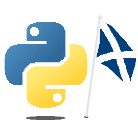

# Welcome to PyScotland 🐍🏴󠁧󠁢󠁳󠁣󠁴󠁿

PyScotland is a community-driven home for Python enthusiasts across Scotland. Whether you're a seasoned developer, a data scientist, a hobbyist, or someone just starting out with Python, PyScotland is here to connect and support you.

Our mission is to bring together Python user groups, meetups, and events throughout the country — from the Highlandsn and Islands, to the Borders — creating a unified space to share knowledge, grow skills, and celebrate all things Python. Think of us as the central hub for Scotland’s vibrant and diverse Python community.
